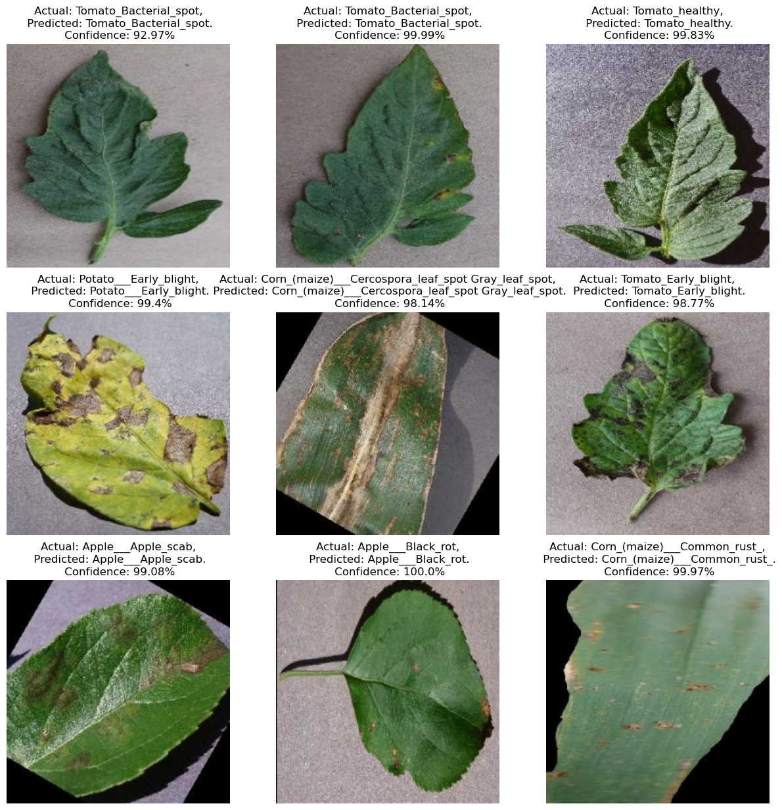

# 🌿 Plant-Disease-Detection-System

The **Plant Disease Detection System** is a deep learning-based web application that uses Convolutional Neural Networks (CNN) and advanced architectures like **ResNet9** to identify plant leaf diseases from images. It helps farmers and agriculturists detect diseases early and take preventive actions.

## 🚀 Features

- 📸 **Upload or Capture Images**: Upload from file or use your device camera via Streamlit.
- 🧠 **Multiple Model Support**:
  - Custom CNN (`model_v1.h5`)
  - ResNet9 (`plant-disease-model.pth`)
  - Experimental models (`potatoes.h5`)
- ⚙️ **Frameworks**: Built using **TensorFlow**, **PyTorch**, and **Streamlit**.
- 📊 **Dataset Support**:
  - [PlantVillage Dataset](https://www.kaggle.com/datasets/emmarex/plantdisease)
  - Custom "NewVillage" Dataset

## 🧪 Directory Structure

```
Plant-Disease-Detection-System/
│
├── LICENSE
├── README.md
├── app.py                # Streamlit app for interface
├── appl.py               # Alternate app version (possibly test/experimental)
├── check_env.py          # Environment check script
├── main.py               # Model training or orchestration logic
├── model_v1.h5           # Keras-based CNN model
├── plant-disease-model.pth  # PyTorch ResNet9 model
├── potatoes.h5           # Additional/experimental model
├── output-plant-disease-detection.png  # Sample output image
├── Plant_disease_Training (newVillage)/ # Training notebook/code
│   └── ...
```

## 🖼️ Sample Output



## 🧠 Model Overview

### 1. **Custom CNN**
- Layers: Conv2D → ReLU → MaxPooling → Dense
- Format: `.h5` (Keras)

### 2. **ResNet9**
- Architecture: 9-layer deep residual network
- Format: `.pth` (PyTorch)
- Benefits: Efficient and accurate for leaf classification tasks

## 🗂️ Datasets Used

- 🌿 [PlantVillage Dataset](https://www.kaggle.com/datasets/emmarex/plantdisease)
- 🌱 *NewVillage Dataset* (custom-labeled local leaf disease images)

## 🔧 Setup Instructions

1. **Clone the repo**:
   ```bash
   git clone https://github.com/javeedshaik13/Plant-Disease-Detection-System.git
   cd Plant-Disease-Detection-System
   ```

2. **Install dependencies**:
   ```bash
   pip install -r requirements.txt
   ```

3. **Run the app**:
   ```bash
   streamlit run app.py
   ```

## 📑 License

This project is licensed under the [GPL-3.0 License](LICENSE).

---
